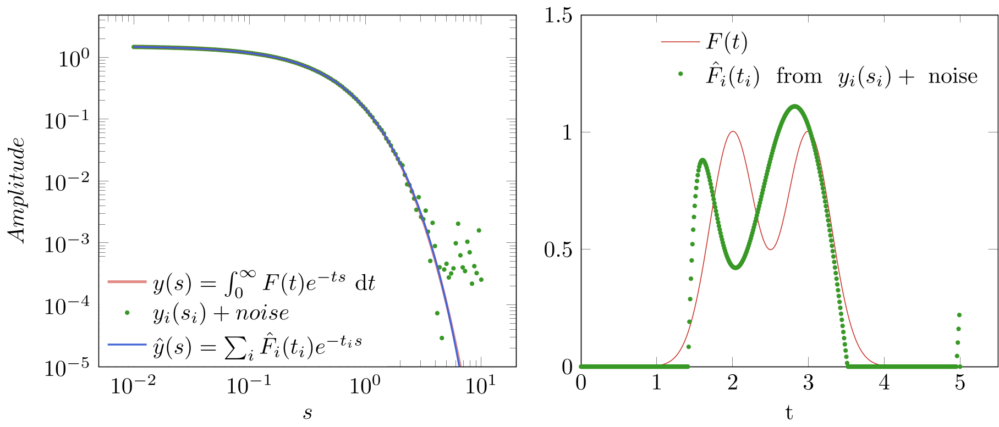

# Fredholm


## Usage
 As an example, consider input data of the following form

 ```julia
using Fredholm, QuadGK, NumericalIntegration, Random
Random.seed!(1234);

F(t) = exp(-(t - 2)^2 / (2 * 0.3^2)) + exp(-(t - 3)^2 / (2 * 0.3^2))
y(s) =  quadgk(t -> F(t) * exp(-t * s), 0, Inf, rtol=1e-6)[1] 

s = 10.0.^(-2:0.05:1)  # generate discrete example data
ys = map(y, s)         # from this is we want to approximate F(t)
noise = (randn(length(ys))) * 0.001 

ti = 0:0.01:5|> collect #define the t-domain for the solution
α = 1.2e-4
t, yt = invert(s, ys .+ noise, ti, (t, s) -> exp(-t * s), Tikhonov(α))
```
The solution `yt` at discrete `t` will very much depend on the choice of the regularization parameter `α`. If more noise is present in the data a higher `α` should be picked and vice versa. 




